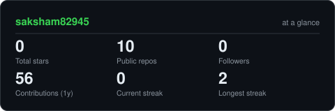
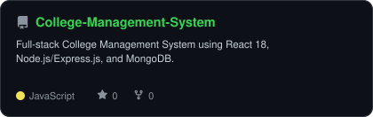
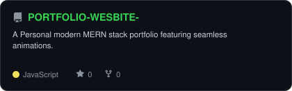
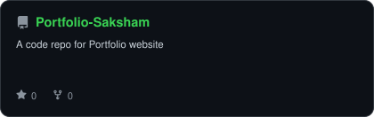
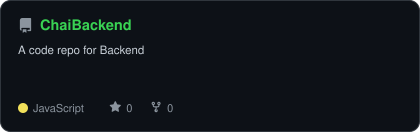
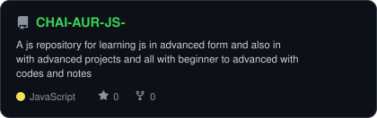
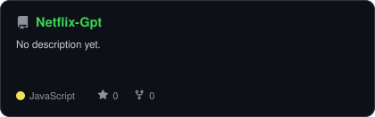

<div align="center">

<!-- PROFILE PICTURE -->


<!-- NAME / TAGLINE - animated typing -->
<a href="https://github.com/saksham82945">

</a>
<br>

<!-- SOCIALS -->
<a href="https://www.linkedin.com/in/saksham-kumar007/"></a>
<a href="mailto:sakshamsinghrajput12345@gmail.com"></a>
<a href="https://portfolio-saksham-sr6g.onrender.com/"></a>
</div>

---

## `~/` whoami

```console
$ cat about.txt
```

Hi, I'm **Saksham Kumar**. I'm a Full-Stack Developer with experience in building scalable web applications.
Currently pursuing my Bachelor of Computer Applications (BCA) at Lalit Narayan Mishra Institute of Economic Development & Social Change (2023 - 2026).

- 💼 Currently building **LinkPort — AI-Powered Career SaaS Platform**
- 🔭 Previously interned as a **Full Stack Developer** at South Bihar Power Distribution Co. Ltd. (SBPDCL)
- 🌱 Core Competencies: **Data Structures & Algorithms, Problem Solving, REST API, OOP**
- ⚡ Fun fact: I love building responsive multi-role SPAs and optimizing backend performance!

<br>

<div align="center">

## `~/` toolbox


</div>

---

<div align="center">

## `~/` skill radar

<table>
<tr>
<td width="50%" align="center" valign="middle">
<!-- Self-rated radar - edit assets/skills.json, re-run radar.py -->
<picture>
<source media="(prefers-color-scheme: dark)" srcset="assets/radar-dark.svg">
<source media="(prefers-color-scheme: light)" srcset="assets/radar-light.svg">

</picture>
</td>
<td width="50%" align="center" valign="middle">
<!-- Live radar built from real language byte counts across your repos -->
<picture>
<source media="(prefers-color-scheme: dark)" srcset="assets/radar-langs-dark.svg">
<source media="(prefers-color-scheme: light)" srcset="assets/radar-langs-light.svg">

</picture>
</td>
</tr>
</table>

</div>

---

<div align="center">

## `~/` contribution calendar

<!-- 3D isometric calendar, regenerated by .github/workflows/metrics.yml -->

<br><br>

<!-- Snake eats the contribution graph -->
<picture>
<source media="(prefers-color-scheme: dark)" srcset="https://raw.githubusercontent.com/saksham82945/saksham82945/snake-output/github-snake-dark.svg">
<source media="(prefers-color-scheme: light)" srcset="https://raw.githubusercontent.com/saksham82945/saksham82945/snake-output/github-snake.svg">

</picture>

</div>

---

<div align="center">

## `~/` the numbers

<!-- Generated by scripts/cards.py — self-hosted, never goes down -->
<picture>
<source media="(prefers-color-scheme: dark)" srcset="assets/card-stats-dark.svg">
<source media="(prefers-color-scheme: light)" srcset="assets/card-stats-light.svg">

</picture>
<br>

<br><br>


</div>

---

<div align="center">

## `~/` selected work

<!-- Projects from Resume -->
<table>
<tr>
<td width="50%" align="center">
<a href="https://github.com/saksham82945/College-Management-System">
<picture>
<source media="(prefers-color-scheme: dark)" srcset="assets/card-College-Management-System-dark.svg">
<source media="(prefers-color-scheme: light)" srcset="assets/card-College-Management-System-light.svg">

</picture>
</a>
</td>
<td width="50%" align="center">
<a href="https://github.com/saksham82945/PORTFOLIO-WESBITE-">
<picture>
<source media="(prefers-color-scheme: dark)" srcset="assets/card-PORTFOLIO-WESBITE--dark.svg">
<source media="(prefers-color-scheme: light)" srcset="assets/card-PORTFOLIO-WESBITE--light.svg">

</picture>
</a>
</td>
</tr>
<tr>
<td width="50%" align="center">
<a href="https://github.com/saksham82945/Portfolio-Saksham">
<picture>
<source media="(prefers-color-scheme: dark)" srcset="assets/card-Portfolio-Saksham-dark.svg">
<source media="(prefers-color-scheme: light)" srcset="assets/card-Portfolio-Saksham-light.svg">

</picture>
</a>
</td>
<td width="50%" align="center">
<a href="https://github.com/saksham82945/ChaiBackend">
<picture>
<source media="(prefers-color-scheme: dark)" srcset="assets/card-ChaiBackend-dark.svg">
<source media="(prefers-color-scheme: light)" srcset="assets/card-ChaiBackend-light.svg">

</picture>
</a>
</td>
</tr>
<tr>
<td width="50%" align="center">
<a href="https://github.com/saksham82945/CHAI-AUR-JS-">
<picture>
<source media="(prefers-color-scheme: dark)" srcset="assets/card-CHAI-AUR-JS--dark.svg">
<source media="(prefers-color-scheme: light)" srcset="assets/card-CHAI-AUR-JS--light.svg">

</picture>
</a>
</td>
<td width="50%" align="center">
<a href="https://github.com/saksham82945/Netflix-Gpt">
<picture>
<source media="(prefers-color-scheme: dark)" srcset="assets/card-Netflix-Gpt-dark.svg">
<source media="(prefers-color-scheme: light)" srcset="assets/card-Netflix-Gpt-light.svg">

</picture>
</a>
</td>
</tr>
</table>
<sub>

| project | stack |
|---|---|
| **College Management System** | `React` `Node.js` `Express` `MongoDB` `Tailwind` `Zustand` |
| **PORTFOLIO-WESBITE-** | `React` `Node.js` `Express` `MongoDB` |
| **Portfolio-Saksham** | `HTML` `CSS` `JavaScript` |
| **ChaiBackend** | `JavaScript` `Node.js` |
| **CHAI-AUR-JS-** | `JavaScript` |
| **Netflix-Gpt** | `React` `JavaScript` |

</sub>
</div>

---

<div align="center">

## GitHub Trophies


</div>

---

<div align="center">

## Random Dev Quote


</div>

